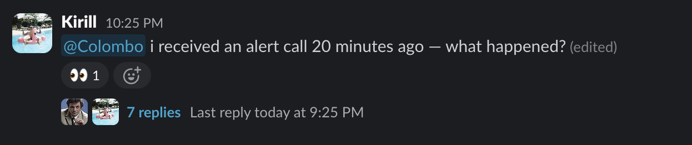

<p align="center">
  
</p>

# 🕵️ Colombo

Answer any operational question in Slack in minutes with a read-only Codex agent connected to your MCP tools.

Colombo is a self-hosted Slack agent for teams whose answers are scattered across tools, dashboards, repos, docs, and colleagues' heads.

Mention `@colombo` in Slack. Colombo starts a read-only Codex investigation through MCP tools and replies in the same thread with evidence, unknowns, and one safe next step.



## Table of contents

- [Who it is for](#who-it-is-for)
- [Why this exists](#why-this-exists)
- [What it does](#what-it-does)
- [How to set up](#how-to-set-up)
  - [Prerequisites](#prerequisites)
  - [Onboard a private workspace](#onboard-a-private-workspace)
  - [Slack app](#slack-app)
  - [Runtime configuration](#runtime-configuration)
  - [Docker launch](#docker-launch)
- [Features](#features)
- [Why not just vibecode it myself?](#why-not-just-vibecode-it-myself)
- [Contributing](#contributing)
- [Publishing / release hygiene](#publishing--release-hygiene)
- [License](#license)

## Who it is for

Colombo is for small teams where work often stops until the right colleague replies: the person who knows the code, infra, funnel, payments, support history, or customer state.

It fits teams already using Codex and MCP, because Colombo depends on the same idea: give Codex read-only access to the tools where the evidence lives.

### Founders and operators: answer product and business questions

```text
@colombo did the new minimum purchase amount change conversion, revenue, or repeat usage this week?
```

### Developers: check whether code changes caused issues

```text
@colombo check logs and metrics for service ABC. Are there any issues after the last commit?
```

### DevOps and SRE: investigate alerts and anomalies

```text
In a thread under a real alert:
@colombo what happened here, and what is the root cause?
```

### Customer support: investigate user cases

```text
@colombo user 18492 paid but still sees the free plan. Why?
```

## Why this exists

Important work slips while developers context-switch between customer and product support, and the questions keep growing like a snowball. Each simple "why?" can take 20+ minutes across logs, payments, analytics, code, and Slack history.

[Kirill](https://github.com/kkeril) built Colombo after watching this happen inside his own team: support asked fair questions, developers were drowning in interrupts, and the answer was usually already inside company tools. Colombo turns the handoff into a Slack-native, read-only Codex investigation through MCP, so the team gets an evidence-backed first read before interrupting the right person.

## What it does

Colombo turns a Slack mention into a fresh, read-only Codex run.

```text
`@colombo` mention with question + thread context
  ↓
Colombo records a job and starts `codex exec --sandbox read-only`
  ↓
Codex reads AGENTS.md and uses only allowlisted MCP servers and tools
  ↓
MCP tools inspect real systems; Codex connects the evidence and writes the answer
  ↓
Colombo posts an evidence-backed reply in the same Slack thread
```

```text
@colombo user 18492 paid but still sees the free plan. Why?
```

Depending on the question, Colombo can compare metrics, inspect logs, check payment and account state, look at product events, read recent commits, and find relevant code paths through your MCP-connected tools.

It replies with the short answer, evidence checked, what is still unknown, and one safe next step.

## How to set up

### Prerequisites

You need:

- Slack workspace where Colombo will answer
- VPS or private server where Colombo will run
- Codex installed and authenticated on that VPS
- Access to the tools you want Colombo to inspect

### Onboard a private workspace

SSH into the VPS and launch Codex there:

```bash
ssh user@your-vps
codex
```

Paste this prompt into Codex:

```text
Set up Colombo on this VPS.

Clone https://github.com/kkeril/colombo into /opt/colombo, then run the repo onboarding skill $colombo-onboarding from the Colombo repo root.
```

Answer the onboarding questions one by one. Onboarding starts with a human welcome that frames what happens next, a short bullet plan, and one setup timing estimate, then explains why it needs the product website before moving to source access, demo answers, Slack app setup, Docker, and launch details.

Onboarding will configure the private Colombo checkout, document connected systems, generate test prompts, and prepare the launch commands. When a connected source needs credentials, onboarding prepares the MCP config and env placeholders first, then asks you to fill exact values in the exact file and reply `done`.

Onboarding writes private company-specific setup into the cloned private workspace: `AGENTS.md` product context, connected-system cards, test messages, and local runtime notes. Do not contribute those private files back to the public Colombo repo.

`AGENTS.md` is the canonical instruction file. If a private workspace has instructions under a different filename, rename that file to `AGENTS.md` before launch; Colombo also treats `agent_instructions_file` as a legacy candidate to rename when `AGENTS.md` is missing.

### Slack app

Create a Slack app with Socket Mode enabled. You can start from [slack-app-manifest.example.yaml](slack-app-manifest.example.yaml), then install the app into the workspace.

Required runtime values:

- `slack_bot_token`: bot token, usually `xoxb-...`.
- `slack_app_token`: app-level Socket Mode token, usually `xapp-...`, with `connections:write`.
- `slack_allowed_user_ids`: comma-separated Slack user IDs allowed to ask Colombo.

The example manifest includes these bot scopes/events: `app_mentions:read`, `chat:write`, `reactions:read`, `reactions:write`, channel/group/DM history scopes, `app_mention`, `reaction_added`, and thread-message events so Colombo can read context and capture feedback replies. During onboarding, document the Slack channel and visibility policy you want Colombo to follow in `AGENTS.md`.

### Runtime configuration

Copy [env.example](env.example) to `/etc/colombo.env` on the VPS and fill it there. Do not commit real token values.

Colombo's Docker runtime mounts the minimal Codex config from `/etc/colombo/codex` to `/home/node/.codex` inside the container. Put only Colombo-approved MCP server definitions there. Do not copy your full personal Codex config.

MCP server credentials must be read-only at the provider level. `codex exec --sandbox read-only` limits local filesystem access; it does not make external systems read-only if an MCP server exposes write tools or uses write-capable credentials.

MCP access is disabled by default in `env.example`. During onboarding, set:

- `codex_mcp_server_names` to the approved server names.
- `codex_mcp_enabled_tools` to a JSON object of server name to approved read-only tool names, for example `{"github":["search_code","get_file"],"grafana":["query"]}`.
- `codex_allow_all_mcp_tools=false` unless the owner deliberately accepts all tools on a trusted read-only MCP server.

### Docker launch

Docker Compose is the primary deployment path.

```bash
sudo mkdir -p /etc/colombo/codex /var/lib/colombo
sudo cp env.example /etc/colombo.env
sudo editor /etc/colombo.env

docker compose build
docker compose up -d
docker compose logs -f colombo
```

The Compose file runs Colombo with a read-only container filesystem, mounts `/opt/colombo` and `/etc/colombo/codex` read-only, keeps `/var/lib/colombo` writable for job state and feedback, and uses `/tmp` as tmpfs. Colombo still launches runtime Codex with `--sandbox read-only`.

The `deploy/*.service` files are optional manual systemd units, not the main setup path. If you use them, create a `colombo` user, run `npm ci && npm run build` in `/opt/colombo`, create `/etc/colombo.env`, `/etc/colombo/codex`, and `/var/lib/colombo`, then install the unit files.

## Features

### Onboarding skill

`$colombo-onboarding` simplifies setup by asking the right questions at the right time: VPS setup, Docker/runtime path, `AGENTS.md` rules, Slack, Codex, and MCP-connected tools.

### Add new source skill

`$colombo-add-new-source` guides setup for a new MCP-connected source: the real system, MCP server/tools, what data to review, what the source is reliable for, what it cannot prove, sensitive-data rules, cross-checks, and example requests. It then suggests the `AGENTS.md` and source-doc updates Colombo needs to use that source safely.

### Feedback loop

It is hard to write the right agent instructions on the first try, especially when "helpful" depends on your tools, team habits, and support cases.

Colombo reduces that setup pain by asking the requester for feedback after each answer with a simple reaction: `:+1:` means the answer met expectations and `:poop:` means it missed. On negative feedback, Colombo asks one follow-up question to understand what was missing, wrong, or incomplete.

Every night, a separate Codex review runs over recent feedback and suggests a plan to fix it. Colombo sends the plan to the bot owner by DM and waits for `:check_mark:` approval before execution.

## Why not just vibecode it myself?

You can. If the idea already feels obvious, you probably should: the Slack bridge, Codex call, and MCP server/tool allowlist are straightforward.

Colombo is open source to save you a few hours of glue work and setup. The main reusable parts are the onboarding, source, and feedback skills: they ask the right questions, write or adjust `AGENTS.md`, document connected systems, generate test prompts, and prepare the runtime path.

## Contributing

Contributions are welcome when they improve the reusable Colombo product: onboarding, Slack behavior, read-only safety, feedback review, tests, runtime defaults, or docs.

Do not contribute private company setup: secrets, customer data, feedback history, internal tool names, connected-system cards, private runbooks, or Codex/MCP config.

Before opening a PR, run:

```bash
npm test
npm run typecheck
npm run build
npm audit --omit=dev
```

## Publishing / release hygiene

Publish or export from git, not from a Finder/manual zip.

Never include `node_modules`, `dist`, `.git`, `__MACOSX`, `.DS_Store`, AppleDouble `._*` files, private workspace files, secrets, or product requirements drafts in a public release.

Suggested clean export:

```bash
git archive --format=tar.gz --output=colombo-open-source.tar.gz HEAD
```

## License

MIT. See `LICENSE`.
